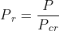
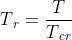
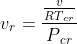
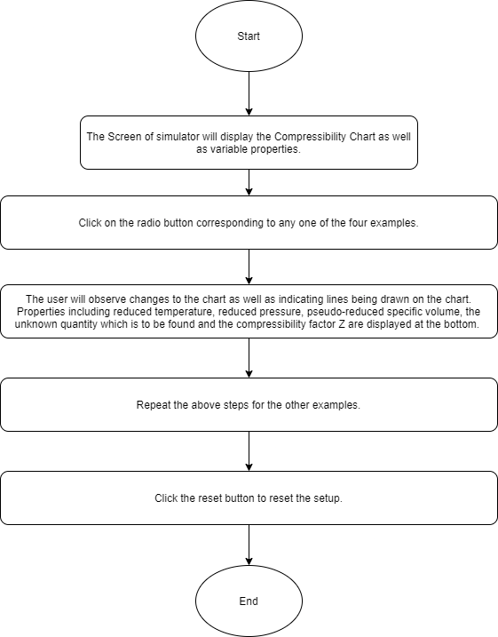
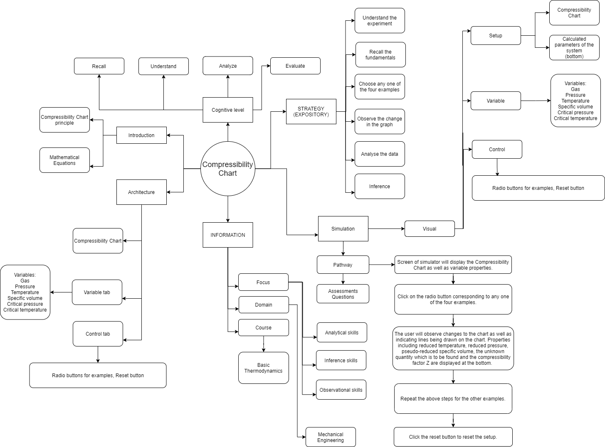
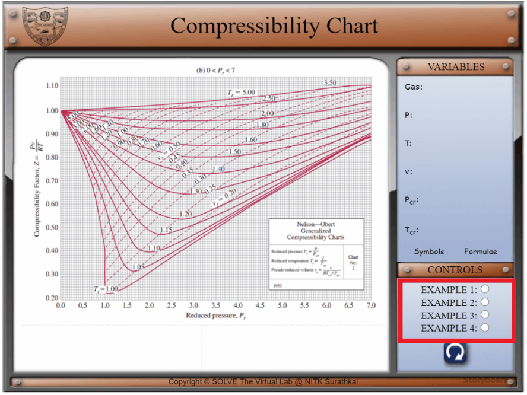

## Storyboard (Round 2)

Experiment: Compressibility Chart

**1. Story Outline**:

The compressibility factor (Z) is a correction factor. The magnitude of Z for a certain gas at a particular pressure and temperature gives an indication of deviation of the gas from ideal gas behaviour.

For a particular gas, the compressibility factor Z is a function of p (pressure) and T (temperature). The compressibility chart is made up of lines of constant temperature on coordinates of p and Z. Using this plot, Z can be determined for any value of p and T. A compressibility factor chart exists for each substance.

In this experiment, we use the Nelson-Obert generalized compressibility chart, in order to demonstrate how to read a generalized compressibility chart as well as how to use it to find unknown quantities like volume.

In order to use a compressibility chart, two of the three reduced properties (reduced pressure, reduced temperature, reduced volume) must be known. Then, the third unknown quantity can be obtained. In a compressibility chart, reduced pressure Pr and compressibility factor Z are on the x-axis and y-axis respectively. When given the reduced pressure and temperature, Z can be determined using the chart.  If any two values out of pressure, temperature and volume of the substance are known, then the third quantity can be found out using the compressibility chart.

 **2. Story**:

  **2.1 Set the visual stage description**:

  The experiment consists of the Nelson-Obert generalized compressibility chart, shown in the main window. All the buttons and the parameters control are on the right side of the frame. The variable panel contains information about the gas used as well as values of five variables (P, T, v, Pcr, Tcr), one of which is to be found out using the graph.

  The controls panel consists of four radio buttons, representing four different examples. On clicking any of the radio buttons, the corresponding graph is shown and indicated lines are drawn on it, according to which quantity is unknown.

  **2.2 Set User Objectives & Goals**:
  * Understand and learn to read the Nelson-Obert generalized compressibility chart.
  * Visualize the method to read the graph with the help of the animated dotted lines drawn on the graph.
  * Analyze the method used to find out the unknown quantity with the help of the formulae given in the formulae tab.
  * Calculate any two of the reduced pressure, reduced temperature and reduced volume (depending on which of the three quantities among pressure, temperature and volume are known).
  * Calculate the final unknown quantity (pressure, temperature or volume).
  * Observe the effect of the gas used and the change in the values of P, v, T on the compressibility factor Z.
  * Observe the usage of different kinds of graphs for different values of reduced pressure.

  **2.3 Set the pathway activities**:

  1. Understand and learn to read the Nelson-Obert generalized compressibility chart.
  2. Visualize the method to read the graph with the help of the animated dotted lines drawn on the graph.
  3. Analyze the method used to find out the unknown quantity with the help of the formulae given in the formulae tab.
  4. Calculate any two of the reduced pressure, reduced temperature and reduced volume (depending on which of the three quantities among pressure, temperature and volume are known).
  5. Calculate the final unknown quantity (pressure, temperature or volume).
  6. Observe the effect of the gas used and the change in the values of P, v, T on the compressibility factor Z.
  7. Observe the usage of different kinds of graphs for different values of reduced pressure.

  **2.4 Set Challenges and Questions/Complexity/variation**

  **2.4.a Questions before simulation**:

  1. Given that the refrigerant R-134a is at 1MPa and its critical pressure value is 4.059 MPa, what is the value of reduced pressure? 
  <ol type="a">
      <li> 0.246</li>
      <li> 4.059</li>
      <li> 1 </li>
      <li> 0.863  </li>
       </ol>
  	Answer a. 0.246

  2. Which of these is correct about the compressibility of ideal gases?
  <ol type="a">
    <li>  Z>1</li>
    <li>  Z<1</li>
    <li>  Z=>1</li>
    <li>  Z=1</li>
   </ol>
  Answer: d. 1

  3. For a certain gas, given that Z=0.84 and videal i.e., the volume obtained from the ideal gas equation is 0.026325 m3/kg, calculate the actual specific volume.
  <ol type="a">
    <li> 31.9 m3/kg</li>
    <li>0.031339 m3/kg</li>
    <li> 0.022113 m3/kg</li>
    <li>None of the above</li>
   </ol>
  Answer: c. 0.022113 m3/kg

  4. Given that the actual specific volume of superheated water is 0.0269 m3/kg, calculate the pseudo-reduced specific volume. (R=0.4615 kJ/kg.K, Pcr=22.06 MPa, Tcr=647.1 K)
  <ol type="a">
    <li>  1.964</li>
    <li> 1.987</li>
    <li> 1.920</li>
    <li>  0.564</li>
     </ol>
  Answer: b. 1.987

  5. Z is defined as
  <ol type="a">
      <li>   Z=Pv/RT</li>
      <li>   Z=vactual/videal</li>
      <li>  Both of the above</li>
      <li>   None of the above</li>
     </ol>
  Answer: c. Both of the above

  6. “The Z factor is approximately the same for all gases at the same reduced temperature and reduced pressure.” Please indicate whether this statement is true or false
  <ol type="a">
    <li> True </li>
    <li> False </li>
  </ol>
  Answer: a. True
   
   

**2.4.b Questions after simulation**

1. “Real gases exhibit ideal-gas behaviour at relatively low pressures and high temperatures.” Please indicate whether this statement is
<ol type="a">
  <li> True </li>
  <li> False</li>
    </ol>
Answer: a. True

2. Pseudo-reduced specific volume vr is defined as
<ol type="a">
  <li>vr=v/vcr</li>
  <li> vr = vactual/(RTcr/Pcr)</li>
  <li> both of the above</li>
  <li> none of the above</li>
    </ol>
Answer: b. vr = vactual/(RTcr/Pcr)

3. Given that the refrigerant R-134a is at 50 °C and its critical temperature value is 374.2 K, what is the value of reduced temperature?
<ol type="a">
  <li>0.863</li>
  <li> 0.133</li>
  <li> 1.158</li>
  <li> 7.484</li>
    </ol>
Answer: a. 0.863

4. What is the advantage of using Z instead of a direct plot of v?
<ol type="a">
  <li> Smaller range of values in plotting</li>
  <li> Larger range of values in plotting</li>
  <li> There is no advantage of using Z</li>
    </ol>
Answer: a. Smaller range of values in plotting

5. Are the reduced properties (reduced pressure, reduced temperature, pseudo-reduced specific volume) dimensionless?
<ol type="a">
<li> True</li>
<li> False</li>
</ol>
Answer: a. True

6. Determine the pressure of refrigerant-134a at 110 °C and 0.016828 m3/kg using the generalized compressibility chart.
<ol type="a">  
  <li> 8466.762 kPa</li>
  <li> 1583 kPa</li>
  <li> 1228 kPa</li>
  <li> 1000.999 kPa</li>
</ol>
Answer: b. 1583 kPa

**2.5 Allow pitfalls: NA**

**2.6 Conclusion**:

Time required to perform the virtual experiment.
The approximate time required to understand the procedure to perform the experiment is around 2 min. The time needed to understand how to read the graph, try out different examples and perform calculations is around 15 min. 
Thus, the total time required to perform the experiment is around 17 min.

**2.7 Abbreviations:**

<!-- # Below are the examples added for reference.
# To get mathematical equatios in html format: go to link: https://www.codecogs.com/latex/eqneditor.php and download equations in png format
# In the same link you have option to download equation as punching

### using png -->

<!-- //markdown syntax -->
1. P = Actual pressure of the
2. T = Actual temperature of the gas
3. v = Actual Specific volume of the gas
4. Pcr = Critical pressure of the gas 
5. Tcr = Critical temperature of the gas
6. Pr = Reduced pressure of the gas
7. Tr = Reduced temperature of the gas
8. vr = Pseudo reduced specific volume of the gas
9. videal = Specific volume of the gas obtained from the ideal-gas equation
10. Z = Compressibility factor
11. R = Gas constant
12. Gas constant of Nitrogen, R = 0.2968 kJ/kg.K
13. Gas constant of R-134a, R = 0.08149 kJ/kg.K
14. Gas constant of Superheated water, R = 0.4615 kJ/kg.K
 

**2.8 Equations/formulae:**

 
 
 
 
 
 
 
 
 
 
 

 
 

 

<!-- //html syntax -->

<!--  -->

**3. Flowchart**:

**4. Mindmap**:

**5. storyboard**:
1. In the simulation window, the Nelson-Obert generalized compressibility chart for 0<Pr<7 is visible.
2. One of the four examples can be selected using the radio buttons, as shown below.

3. The various symbols and the formulae involved in the experiment are displayed in the control panel when the cursor hovers over ‘Symbols’ and ‘Formulae’ respectively.

4. The graph changes as different examples are selected, depending on whether the value of Pr is greater than or lesser than 1.

5.   The gas used, the values of four properties as well as which quantity is to be found, is displayed in the ‘VARIABLES’ panel.

6. Properties including Tr (reduced temperature), Pr (reduced pressure), vr (pseudo-reduced specific volume), the unknown quantity which is to be found and the compressibility factor Z are displayed at the bottom. When the unknown quantity is v, videal (specific volume of the gas obtained from the ideal-gas equation) is also displayed at the bottom.

**6. References**:

References for Compressibility Chart:
[1]  Basic and Applied Thermodynamics - P.K. Nag
[2] Thermodynamics : An engineering approach - Cengel and Boles
